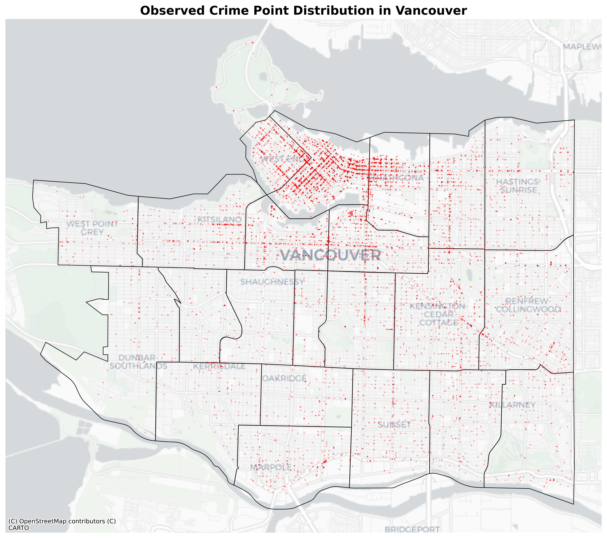
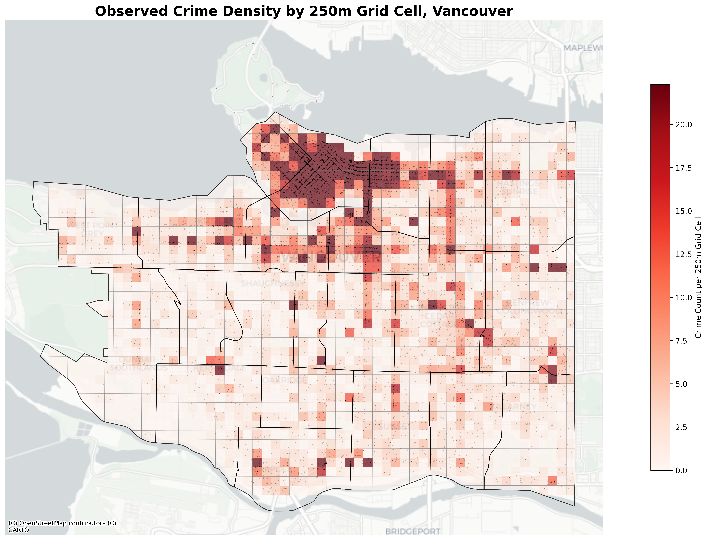
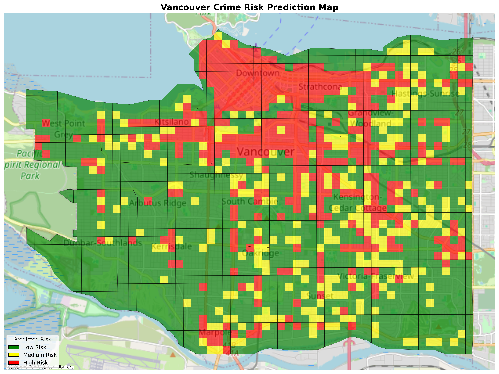

# Vancouver Crime Risk Mapping using GIS and Machine Learning

## Project Overview

This project analyzes crime patterns in Vancouver using GIS and machine learning. The goal was to convert raw crime incident records into spatial data, aggregate crimes into a 250m grid, engineer spatial and temporal features, and train a machine learning model to classify areas into low, medium, and high crime-risk zones.

The project was built using Python, GeoPandas, Shapely, Matplotlib, Contextily, and scikit-learn.

## Project Objectives

* Convert raw Vancouver crime records into GIS point data
* Create a 250m spatial grid across Vancouver
* Count crime incidents within each grid cell
* Add neighbourhood, spatial, and temporal features
* Build a machine learning dataset for crime-risk classification
* Train a Random Forest classifier
* Visualize observed crime density and predicted crime-risk zones

## Data Sources

* Vancouver crime data from the Vancouver Police Department open data portal
* Vancouver local area boundary GeoJSON data

## Tools and Libraries Used

* Python
* Pandas
* GeoPandas
* Shapely
* NumPy
* Matplotlib
* Contextily
* scikit-learn
* Joblib
* OpenStreetMap / CartoDB basemaps

## Methodology

### 1. Data Cleaning and GIS Conversion

The raw crime CSV was cleaned by removing records with missing or invalid coordinates. Crime records were then converted into spatial point geometries using the `X` and `Y` coordinate fields.

The crime points were assigned the projected coordinate reference system EPSG:26910, which is suitable for Vancouver spatial analysis.

### 2. Grid Creation

A 250m spatial grid was created across Vancouver. Each grid cell became one spatial analysis unit. The Vancouver neighbourhood boundary layer was dissolved into a single city boundary and used to clip the grid to the study area.

Each final grid cell was assigned a unique `grid_id`.

### 3. Crime Aggregation

Crime points were spatially joined to the grid cells. The number of crimes inside each grid cell was counted and stored as `crime_count`.

This transformed the dataset from individual crime incidents into a structured grid-based dataset suitable for analysis and machine learning.

### 4. Feature Engineering

The following features were created:

* `x`: centroid x-coordinate of each grid cell
* `y`: centroid y-coordinate of each grid cell
* `distance_to_center`: distance from each grid cell to Vancouver’s city center
* `night_ratio`: proportion of crimes occurring during night-time hours
* `weekend_ratio`: proportion of crimes occurring on weekends
* `avg_hour`: average hour of crime occurrence
* neighbourhood one-hot encoded features

### 5. Risk Class Creation

Crime counts were converted into three risk classes:

* Low risk: 0–2 crimes
* Medium risk: 3–4 crimes
* High risk: 5 or more crimes

This created the target variable for the machine learning model.

### 6. Machine Learning Model

A Random Forest classifier was trained to classify each grid cell into low, medium, or high crime-risk categories.

The model used spatial, temporal, and neighbourhood-based features.

## Model Performance

The Random Forest model achieved an accuracy of approximately 89%.

### Classification Report Summary

| Class       | Precision | Recall | F1-score |
| ----------- | --------: | -----: | -------: |
| Low Risk    |      0.94 |   0.97 |     0.95 |
| Medium Risk |      0.65 |   0.61 |     0.63 |
| High Risk   |      0.89 |   0.85 |     0.87 |

Overall accuracy: 89.1%

The model performed strongest on low-risk and high-risk cells. Medium-risk cells were more difficult to classify because they represent transition zones between low-crime areas and crime hotspots.

## Output Maps and Visualizations

### 1. Observed Crime Point Distribution

This map shows the original crime incident locations across Vancouver. Crime points are concentrated most strongly around Downtown, West End, and central/eastern Vancouver corridors.



---

### 2. Observed Crime Density by 250m Grid Cell

Crime incidents were aggregated into 250m grid cells. Darker red cells represent areas with higher observed crime counts.



---

### 3. Night-Time Crime Ratio by 250m Grid Cell

This map shows the proportion of crimes in each grid cell that occurred during night-time hours. Higher values indicate areas where crime activity is more night-oriented.


---

### 4. Predicted Crime Risk Map

The Random Forest model classified each 250m grid cell into low, medium, or high crime-risk categories.

Green represents low risk, yellow represents medium risk, and red represents high risk.



---

### 5. Feature Importance

This chart shows which features contributed most to the model’s predictions. Night-time crime ratio, average crime hour, weekend crime ratio, and distance to city center were among the strongest predictors.


---

### 6. Average Temporal Crime Patterns by Risk Class

This chart compares average night-time and weekend crime ratios across low-, medium-, and high-risk grid cells.


## Key Results

* Created 1,975 spatial grid cells across Vancouver
* Used a 250m grid resolution for detailed local analysis
* Classified grid cells into low, medium, and high crime-risk categories
* Achieved approximately 89% model accuracy
* Found that temporal crime patterns were important predictors of crime-risk classification
* Produced observed and predicted crime-risk maps for portfolio presentation

## Skills Demonstrated

* GIS data processing
* Coordinate reference system handling
* Spatial joins
* Grid-based spatial analysis
* Feature engineering
* Crime hotspot mapping
* Machine learning classification
* Random Forest modeling
* Model evaluation
* Feature importance analysis
* Geospatial visualization
* Python project organization

## Limitations

This project should be interpreted as a spatial crime-risk classification project, not a real-time crime forecasting system. The model uses historical crime patterns and spatial-temporal features to classify risk levels. Random train/test splitting may produce optimistic results because nearby grid cells can be spatially similar.

Future improvements could include:

* Time-based forecasting
* Spatial cross-validation
* Population density features
* Land-use data
* Police station proximity
* Regression-based crime count prediction
* Testing the workflow on another city

## Project Structure

```text
Vancouver-Crime-Risk-Mapping/
│
├── Data/
│   ├── crime.csv
│   └── local-area-boundary.geojson
│
├── Scripts/
│   ├── project.py
│   ├── ml_dataset.py
│   ├── ml_model.py
│   └── prediction_map.py
│
├── outputs/
│   ├── crime_points.geojson
│   ├── neighbourhoods.geojson
│   ├── crime_grid.geojson
│   ├── grid.geojson
│   ├── ml_data.csv
│   ├── crime_model.pkl
│   ├── feature_columns.pkl
│   └── output PNG maps
│
├── README.md
├── requirements.txt
└── .gitignore
```

## Author

Uzair
Bachelor of Information Technology student
Fairleigh Dickinson University, Vancouver Campus
